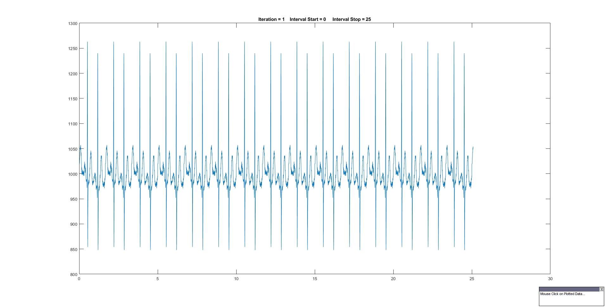
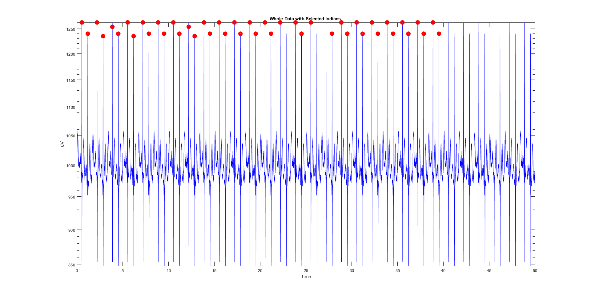

# Manual Point Selection Plotter

This is Specifically made for manual R-peak selection to check results of Algorithmic Selection.

Although it can be used for various scenarios.

The program Divides data into Several plots with pecified time  length and help with manually selecting points with the pointer. Then Saves points into a File named "IndexSelected.mat".

### ***point 1:***
Imported Data should Contain:
1. Recorded 1-Channel Signal
2. Sampling Frequency of the Signal

### ***point 2:***
During the selection you can: 
1. Switch into next plot with **'n'**
2. End the selection process with **'c'**

> Selection Process Plots Looks Like

> Post Selection Plot Be Like
